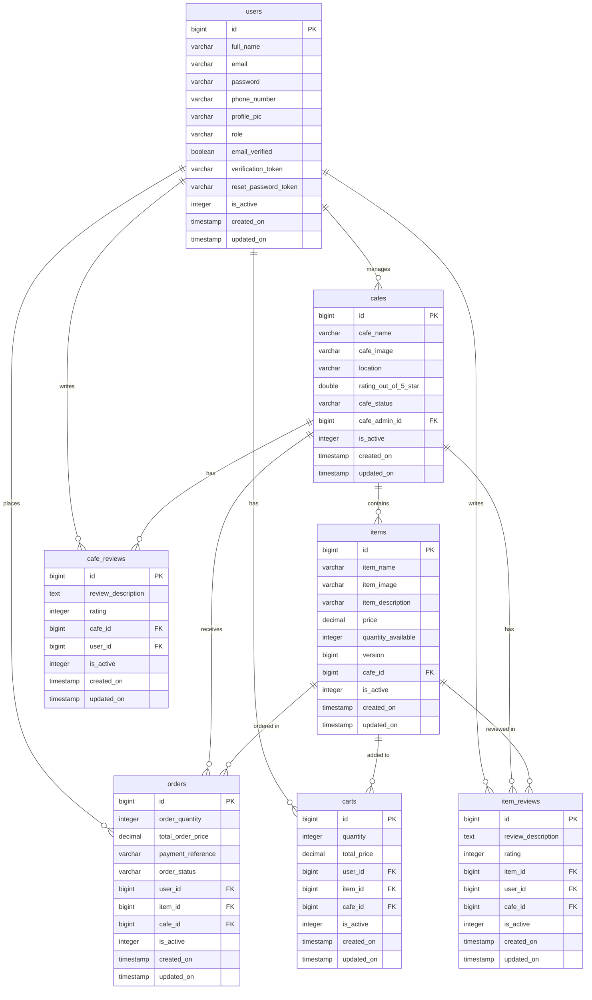

# Sweet And Karak - Backend API

## Overview

Sweet And Karak is a cafe ordering platform built with Java Spring Boot and PostgreSQL. The platform supports three roles: system admin who manages the platform, cafe admins who run their own cafes, and customers who browse and order. New users must verify their email before they can log in.

---

## Technology Stack

- Java 17
- Spring Boot 4.0.6
- Spring Data JPA
- Spring Security with JWT (jjwt 0.12.6)
- PostgreSQL 15
- Lombok
- Jakarta Validation
- JavaMail with MailTrap SMTP

---

## Project Structure

```
src/main/java/com/example/sweetandkarak/
├── SweetAndKarakApplication.java
├── config/
│   ├── DataSeeder.java
│   ├── FileUploadConfig.java
│   ├── JwtAuthFilter.java
│   ├── JwtUtil.java
│   ├── MailConfig.java
│   ├── OrderConcurrencyManager.java
│   └── SecurityConfig.java
├── controller/
│   ├── AuthController.java
│   ├── CafeController.java
│   ├── CartController.java
│   ├── ItemController.java
│   ├── OrderController.java
│   ├── ReviewController.java
│   └── UserController.java
├── dto/
│   ├── request/
│   │   ├── CafeCreateRequest.java
│   │   ├── CartRequest.java
│   │   ├── ForgotPasswordRequest.java
│   │   ├── ItemCreateRequest.java
│   │   ├── LoginRequest.java
│   │   ├── OrderRequest.java
│   │   ├── ResetPasswordRequest.java
│   │   ├── ReviewRequest.java
│   │   ├── UserSignupRequest.java
│   │   └── UserUpdateRequest.java
│   └── response/
│       ├── ApiResponse.java
│       ├── AuthResponse.java
│       ├── CafeResponse.java
│       ├── CartResponse.java
│       ├── ItemResponse.java
│       ├── OrderResponse.java
│       ├── ReviewResponse.java
│       └── UserResponse.java
├── enums/
│   ├── CafeStatusEnum.java
│   ├── OrderStatusEnum.java
│   └── RoleEnum.java
├── exception/
│   ├── CafeNotApprovedException.java
│   ├── DuplicateResourceException.java
│   ├── GlobalExceptionHandler.java
│   ├── InvalidOrderException.java
│   ├── ResourceNotFoundException.java
│   ├── StockUnavailableException.java
│   └── UnauthorizedActionException.java
├── mapper/
│   ├── CafeMapper.java
│   ├── CartMapper.java
│   ├── ItemMapper.java
│   ├── OrderMapper.java
│   ├── ReviewMapper.java
│   └── UserMapper.java
├── model/
│   ├── BaseEntity.java
│   ├── Cafe.java
│   ├── CafeReview.java
│   ├── Cart.java
│   ├── Item.java
│   ├── ItemReview.java
│   ├── Order.java
│   └── User.java
├── repository/
│   ├── CafeRepository.java
│   ├── CafeReviewRepository.java
│   ├── CartRepository.java
│   ├── ItemRepository.java
│   ├── ItemReviewRepository.java
│   ├── OrderRepository.java
│   └── UserRepository.java
├── service/
│   ├── AuthService.java
│   ├── CafeService.java
│   ├── CartService.java
│   ├── CustomUserDetailsService.java
│   ├── EmailService.java
│   ├── ItemService.java
│   ├── OrderService.java
│   ├── ReviewService.java
│   └── UserService.java
└── util/
    └── FileUploadUtil.java
```

---

## Database ERD



---

## Enums

### RoleEnum

| Value | Description |
|---|---|
| SYSTEM_ADMIN | Full platform access |
| CAFE_ADMIN | Manages own cafes and items |
| CUSTOMER | Places orders and leaves reviews |

### CafeStatusEnum

| Value | Description |
|---|---|
| PENDING_APPROVAL | Submitted, waiting for admin review |
| APPROVED | Visible to customers and guests |
| REJECTED | Declined by admin |
| INACTIVE | Disabled by admin |

### OrderStatusEnum

| Value | Description |
|---|---|
| PENDING | Order created |
| PAID | Payment reference confirmed |
| PREPARING | Cafe is preparing the order |
| DELIVERED | Order handed to customer |
| CANCELLED | Cancelled by customer |
| FAILED_PAYMENT | Payment reference was missing |

---

## Role Permissions

| Action | Guest | Customer | Cafe Admin | System Admin |
|---|---|---|---|---|
| Browse approved cafes | Yes | Yes | Yes | Yes |
| Browse active items | Yes | Yes | Yes | Yes |
| Signup and Login | Yes | - | - | - |
| Add to cart | - | Yes | - | - |
| Place order | - | Yes | - | - |
| Filter own orders by status | - | Yes | - | - |
| Cancel own order | - | Yes | - | - |
| Write reviews | - | Yes | - | - |
| Create cafe | - | No | Yes | Yes |
| Manage own cafe items | - | No | Yes | Yes |
| Upload cafe or item images | - | No | Yes | Yes |
| Activate or deactivate own cafe | - | No | Yes | Yes |
| Delete own cafe | - | No | Yes | Yes |
| View cafe orders | - | No | Yes | Yes |
| Update order status | - | No | Yes | Yes |
| Approve or reject cafes | - | No | No | Yes |
| Activate or deactivate any cafe | - | No | No | Yes |
| Manage all users | - | No | No | Yes |
| View all orders | - | No | No | Yes |
| Filter all orders by status | - | No | No | Yes |
| Delete cafes or items | - | No | No | Yes |

---

## Setup

### Requirements

- Java 17
- PostgreSQL 15
- Maven 3.8+

### application.properties

```properties
spring.application.name=Sweet And Karak
server.port=8080

spring.datasource.url=jdbc:postgresql://localhost:5432/sweetandkarak
spring.datasource.username=postgres
spring.datasource.password=123456789
spring.datasource.driver-class-name=org.postgresql.Driver

spring.jpa.hibernate.ddl-auto=update
spring.jpa.show-sql=true
spring.jpa.open-in-view=true

spring.mvc.static-path-pattern=/uploads/**
spring.web.resources.static-locations=file:uploads/,classpath:/static/

spring.mail.host=sandbox.smtp.mailtrap.io
spring.mail.port=2525
spring.mail.username=84f1139a0abcda
spring.mail.password=410d9f8f403eb4
spring.mail.properties.mail.smtp.auth=true
spring.mail.properties.mail.smtp.starttls.enable=true

spring.servlet.multipart.enabled=true
spring.servlet.multipart.max-file-size=10MB
spring.servlet.multipart.max-request-size=10MB

app.upload.dir=uploads/
app.admin.email=admin@sweetkarak.com

app.jwt.secret=C6UlILsE6GJwNqwCTkkvJj9O653yJUoteWMLfYyrc3vaGrrTOrJFAUD1wEBnnposzcQl
app.jwt.expiration=86400000

logging.level.org.springframework.security=DEBUG
```

### Run

```bash
mvn package -Dmaven.test.skip=true
mvn spring-boot:run
```

Tables are created automatically on first run. The DataSeeder runs on startup and populates the database if the users table is empty.

---

## Authentication Flow

### Signup

New users must verify their email before they can log in. The flow is:

1. User calls `POST /api/auth/signup`
2. Account is created with `emailVerified = false`
3. A verification email is sent to the user with a token
4. User calls `POST /api/auth/verify-email?token=...` using the token from the email
5. Account is marked as `emailVerified = true`
6. A welcome email is sent
7. User can now call `POST /api/auth/login`

Seeded accounts skip this flow because they are created directly in the database with `emailVerified = true`.

### Login

Login checks that `emailVerified` is true before authenticating. If not verified, the user gets an error message to check their inbox.

### Forgot Password

1. User calls `POST /api/auth/forgot-password` with their email
2. A reset token is generated and saved on the user record
3. An email is sent with the token
4. User calls `POST /api/auth/reset-password` with the token and new password
5. Password is updated and reset token is cleared

### JWT Token

All protected endpoints require the token in the Authorization header:

```
Authorization: Bearer your_jwt_token_here
```

Tokens expire after 24 hours by default (86400000 ms).

---

## Seeded Test Accounts

All seeded accounts have `emailVerified = true` and can log in immediately without email verification.

| Role | Email | Password |
|---|---|---|
| SYSTEM_ADMIN | admin@sweetkarak.com | admin123 |
| CAFE_ADMIN | mohammed@sweetkarak.com | 123456 |
| CAFE_ADMIN | sara@sweetkarak.com | 123456 |
| CAFE_ADMIN | khalid@sweetkarak.com | 123456 |
| CUSTOMER | ahmad@gmail.com | 123456 |
| CUSTOMER | fatima@gmail.com | 123456 |
| CUSTOMER | yusuf@gmail.com | 123456 |
| CUSTOMER (inactive) | inactive@gmail.com | 123456 |

### Seeded Data

- 6 cafes: 2 APPROVED, 2 PENDING_APPROVAL, 1 REJECTED, 1 INACTIVE
- 13 items: 11 active (karak drinks and traditional sweets), 2 inactive
- 7 orders covering all statuses: DELIVERED x2, PAID, PREPARING, PENDING, CANCELLED, FAILED_PAYMENT
- 4 cart entries across 3 customers
- 9 item reviews, 6 cafe reviews

### Seeded Items

Karak House (Approved):
- Classic Karak Tea - BD 0.500
- Saffron Karak - BD 0.800
- Karak Latte - BD 1.000
- Kunafa Slice - BD 1.200
- Luqaimat - BD 0.750
- Karak Cappuccino - BD 1.200 (inactive)

Bait Al Karak (Approved):
- Cardamom Karak - BD 0.600
- Rose Karak - BD 0.700
- Mint Karak - BD 0.650
- Basbousa - BD 0.800
- Date Cake - BD 1.000
- Halwa Shaameya - BD 0.900
- Ginger Karak - BD 0.750 (inactive)

### Reset Database

```sql
TRUNCATE TABLE cafe_reviews, item_reviews, carts, orders, items, cafes, users CASCADE;
```

Then restart the app and the DataSeeder repopulates everything.

---

## Standard API Response Format

```json
{
  "success": true,
  "message": "Description of result",
  "data": {},
  "timestamp": "2025-05-24T10:00:00"
}
```

---

## Error Responses

| HTTP Status | When It Happens |
|---|---|
| 400 | Validation failed, stock unavailable, cafe not approved, invalid order action |
| 401 | Missing or invalid token |
| 403 | Authenticated but wrong role or trying to manage someone else's resource |
| 404 | Resource not found |
| 409 | Duplicate email or cafe name |
| 500 | Unexpected server error |

---

## API Reference

### Auth

Base path: `/api/auth` : all public, no token required.

| Method | Endpoint | Description |
|---|---|---|
| POST | /api/auth/signup | Register a new customer account |
| POST | /api/auth/verify-email?token= | Verify email using token from email |
| POST | /api/auth/login | Login and receive JWT token |
| POST | /api/auth/forgot-password | Request a password reset email |
| POST | /api/auth/reset-password | Reset password using token from email |

Signup request:

```json
{
  "fullName": "Ahmad Ali",
  "email": "ahmad@gmail.com",
  "password": "123456",
  "phoneNumber": "39001234"
}
```

Signup response : returns a message string, not a token. The user must verify email first:

```json
{
  "success": true,
  "message": "Registration successful. Please check your email to verify your account before logging in.",
  "data": null
}
```

Login request:

```json
{
  "email": "ahmad@gmail.com",
  "password": "123456"
}
```

Login response:

```json
{
  "success": true,
  "message": "Login successful",
  "data": {
    "token": "eyJhbGci...",
    "email": "ahmad@gmail.com",
    "fullName": "Ahmad Ali",
    "role": "CUSTOMER"
  }
}
```

Forgot password request:

```json
{
  "email": "ahmad@gmail.com"
}
```

Reset password request:

```json
{
  "token": "uuid-token-from-email",
  "newPassword": "newpassword123"
}
```

---

### Users

Base path: `/api/users`

| Method | Endpoint | Access | Description |
|---|---|---|---|
| GET | /api/users/me | Any logged-in user | Get own profile |
| PUT | /api/users/me | Any logged-in user | Update own profile |
| POST | /api/users/me/profile-pic | Any logged-in user | Upload profile picture (multipart, field: file) |
| GET | /api/users | SYSTEM_ADMIN | Get all users paginated |
| GET | /api/users/{id} | SYSTEM_ADMIN | Get user by ID |
| GET | /api/users/search?name= | SYSTEM_ADMIN | Search users by name |
| PATCH | /api/users/{id}/activate | SYSTEM_ADMIN | Activate a user |
| PATCH | /api/users/{id}/deactivate | SYSTEM_ADMIN | Deactivate a user |
| DELETE | /api/users/{id} | SYSTEM_ADMIN | Delete a user |

Update profile request:

```json
{
  "fullName": "Ahmad Ali Updated",
  "phoneNumber": "39009999"
}
```

---

### Cafes

Base path: `/api/cafes`

Public endpoints return only APPROVED cafes with isActive = 1. Status labels are never exposed on public endpoints.

| Method | Endpoint | Access | Description |
|---|---|---|---|
| GET | /api/cafes | Public | Get approved and active cafes |
| GET | /api/cafes/search?name= | Public | Search approved and active cafes |
| GET | /api/cafes/{id} | Public | Get cafe by ID |
| POST | /api/cafes | CAFE_ADMIN, SYSTEM_ADMIN | Submit a new cafe for approval |
| GET | /api/cafes/my | CAFE_ADMIN, SYSTEM_ADMIN | Get own cafes |
| POST | /api/cafes/{id}/image | CAFE_ADMIN, SYSTEM_ADMIN | Upload cafe image (multipart, field: file) |
| PATCH | /api/cafes/{id}/my/activate | CAFE_ADMIN, SYSTEM_ADMIN | Activate own cafe |
| PATCH | /api/cafes/{id}/my/deactivate | CAFE_ADMIN, SYSTEM_ADMIN | Deactivate own cafe |
| DELETE | /api/cafes/{id}/my | CAFE_ADMIN, SYSTEM_ADMIN | Delete own cafe |
| GET | /api/cafes/admin/all | SYSTEM_ADMIN | Get all cafes with all statuses |
| GET | /api/cafes/status?status= | SYSTEM_ADMIN | Filter cafes by status |
| PATCH | /api/cafes/{id}/approve | SYSTEM_ADMIN | Approve a cafe |
| PATCH | /api/cafes/{id}/reject | SYSTEM_ADMIN | Reject a cafe |
| PATCH | /api/cafes/{id}/activate | SYSTEM_ADMIN | Activate any cafe |
| PATCH | /api/cafes/{id}/deactivate | SYSTEM_ADMIN | Deactivate any cafe |
| DELETE | /api/cafes/{id} | SYSTEM_ADMIN | Delete any cafe |

Create cafe request : the admin is taken from JWT, no cafeAdminId needed:

```json
{
  "cafeName": "Karak House",
  "location": "Manama, Bahrain"
}
```

New cafes always start as PENDING_APPROVAL and become visible to customers only after a system admin approves them and they are active.

Status filter values: PENDING_APPROVAL, APPROVED, REJECTED, INACTIVE.

The cafe admin can activate, deactivate, or delete only their own cafes. Trying to manage another admin's cafe returns 403.

---

### Items

Base path: `/api/items`

Public endpoints return only active items (isActive = 1). Inactive items are hidden from customers and guests.

| Method | Endpoint | Access | Description |
|---|---|---|---|
| GET | /api/items/cafe/{cafeId} | Public | Get active items for a cafe |
| GET | /api/items/search?name= | Public | Search active items by name |
| GET | /api/items/search?name=&cafeId= | Public | Search active items within a cafe |
| GET | /api/items/{id} | Public | Get item by ID |
| GET | /api/items/admin/cafe/{cafeId} | CAFE_ADMIN, SYSTEM_ADMIN | Get all items including inactive |
| POST | /api/items | CAFE_ADMIN, SYSTEM_ADMIN | Create an item |
| PUT | /api/items/{id} | CAFE_ADMIN, SYSTEM_ADMIN | Update an item |
| POST | /api/items/{id}/image | CAFE_ADMIN, SYSTEM_ADMIN | Upload item image (multipart, field: file) |
| PATCH | /api/items/{id}/activate | CAFE_ADMIN, SYSTEM_ADMIN | Activate an item |
| PATCH | /api/items/{id}/deactivate | CAFE_ADMIN, SYSTEM_ADMIN | Deactivate an item |
| DELETE | /api/items/{id} | CAFE_ADMIN, SYSTEM_ADMIN | Delete an item |

Create or update item request:

```json
{
  "itemName": "Classic Karak Tea",
  "itemDescription": "Traditional sweet spiced karak tea",
  "price": 0.500,
  "quantityAvailable": 100,
  "cafeId": 1
}
```

Items can only be added to cafes with status APPROVED. Adding to a pending or rejected cafe returns 400.

---

### Cart

Base path: `/api/cart` : CUSTOMER only.

| Method | Endpoint | Description |
|---|---|---|
| POST | /api/cart | Add item to cart |
| GET | /api/cart | Get own cart |
| PATCH | /api/cart/{cartId}/quantity?quantity= | Update quantity of a cart entry |
| DELETE | /api/cart/{cartId} | Remove one item from cart |
| DELETE | /api/cart/clear | Remove all items from cart |
| POST | /api/cart/checkout | Checkout and clear cart |

Add to cart request:

```json
{
  "userId": 5,
  "itemId": 1,
  "quantity": 2
}
```

If the item is already in the cart, the quantity is added to the existing entry rather than creating a duplicate.

---

### Orders

Base path: `/api/orders`

| Method | Endpoint | Access | Description |
|---|---|---|---|
| POST | /api/orders | CUSTOMER | Place an order |
| GET | /api/orders/my | CUSTOMER, CAFE_ADMIN, SYSTEM_ADMIN | Get own orders |
| GET | /api/orders/my/status?status= | CUSTOMER, CAFE_ADMIN, SYSTEM_ADMIN | Filter own orders by status |
| PATCH | /api/orders/{id}/cancel | CUSTOMER | Cancel an order |
| GET | /api/orders/{id} | Any authenticated user | Get order by ID |
| GET | /api/orders/cafe/{cafeId} | CAFE_ADMIN, SYSTEM_ADMIN | Get orders for a specific cafe |
| GET | /api/orders/status?status= | CAFE_ADMIN, SYSTEM_ADMIN | Filter all orders by status |
| PATCH | /api/orders/{id}/status?status= | CAFE_ADMIN, SYSTEM_ADMIN | Update order status |
| GET | /api/orders | SYSTEM_ADMIN | Get all orders |

Place order request:

```json
{
  "itemId": 1,
  "orderQuantity": 2,
  "paymentReference": "PAY-REF-001"
}
```

If paymentReference is null or empty the order status is set to FAILED_PAYMENT. If a value is provided the status is set to PAID.

Order status flow: PAID to PREPARING to DELIVERED.

Orders with status DELIVERED or CANCELLED cannot be cancelled.

The `GET /api/orders/my/status` endpoint is for customers to filter their own orders by status. The `GET /api/orders/status` endpoint is for admins and cafe admins to filter all platform orders by status. These are two separate endpoints to enforce the security boundary.

Status values: PENDING, PAID, PREPARING, DELIVERED, CANCELLED, FAILED_PAYMENT.

---

### Reviews

Base path: `/api/reviews`

| Method | Endpoint | Access | Description |
|---|---|---|---|
| GET | /api/reviews/item/{itemId} | Public | Get reviews for an item |
| GET | /api/reviews/cafe/{cafeId} | Public | Get reviews for a cafe |
| POST | /api/reviews/item/{itemId} | CUSTOMER | Add a review for an item |
| POST | /api/reviews/cafe/{cafeId} | CUSTOMER | Add a review for a cafe |
| GET | /api/reviews/my | CUSTOMER | Get own reviews |
| DELETE | /api/reviews/item/{reviewId} | Review owner | Delete own item review |
| DELETE | /api/reviews/cafe/{reviewId} | Review owner | Delete own cafe review |

Add review request:

```json
{
  "reviewDescription": "Best karak in Bahrain!",
  "rating": 5
}
```

Rating must be between 1 and 5. Adding a cafe review recalculates and updates the cafe average rating automatically.

---

## Email Notifications

All emails are sent via MailTrap sandbox. No real emails reach actual inboxes during development.

| When | Who receives it |
|---|---|
| User signs up | User receives verification email with token |
| Email verified | User receives welcome email |
| Forgot password | User receives reset token email |
| Cafe submitted | Cafe admin and system admin both receive notification |
| Cafe approved | Cafe admin receives approval confirmation |
| Cafe rejected | Cafe admin receives rejection notification |

To check emails go to mailtrap.io and open the inbox. The credentials in application.properties control which inbox receives the emails.

---

## Image Upload

Images are stored on disk in the uploads/ directory. Subfolders are created automatically.

| Type | Storage path |
|---|---|
| Profile pictures | uploads/profile/ |
| Cafe images | uploads/cafe/ |
| Item images | uploads/item/ |

Accepted file types: jpg, jpeg, png, webp. Maximum file size: 10MB.

Images are served as static resources at:

```
http://localhost:8080/uploads/{filename}
```

---

## Concurrency and Stock Handling

Stock deduction when placing orders is protected by three layers:

- Pessimistic locking: `@Lock(LockModeType.PESSIMISTIC_WRITE)` locks the item row in the database during order placement so no two transactions can modify stock at the same time
- Per-item ReentrantLock: `OrderConcurrencyManager` holds a lock per item ID at the application level to serialize concurrent requests before they reach the database
- Optimistic locking: `@Version` field on the Item entity catches any conflicting writes that bypass the other two layers

If two customers order the same last item simultaneously, one succeeds and the other receives 400 with "Insufficient stock".

---

## Docker

### Dockerfile

```dockerfile
FROM eclipse-temurin:17-jdk-jammy
VOLUME /tmp
EXPOSE 8080
RUN mkdir -p /app/
RUN mkdir -p /app/logs/
ADD target/sweetandkarak-0.0.1-SNAPSHOT.jar /app/app.jar
ENTRYPOINT ["java","-Djava.security.egd=file:/dev/./urandom","-jar","/app/app.jar"]
```

### docker-compose.yml

```yaml
version: "3.7"

services:
  api_service:
    build: .
    restart: always
    ports:
      - 8080:8080
    depends_on:
      - postgres_db
    links:
      - postgres_db:database
    environment:
      SPRING_DATASOURCE_URL: jdbc:postgresql://database:5432/sweetandkarak
      SPRING_DATASOURCE_USERNAME: postgres
      SPRING_DATASOURCE_PASSWORD: 123456789
      APP_JWT_SECRET: C6UlILsE6GJwNqwCTkkvJj9O653yJUoteWMLfYyrc3vaGrrTOrJFAUD1wEBnnposzcQl
      APP_JWT_EXPIRATION: 86400000
      SPRING_MAIL_HOST: sandbox.smtp.mailtrap.io
      SPRING_MAIL_PORT: 2525
      SPRING_MAIL_USERNAME: 84f1139a0abcda
      SPRING_MAIL_PASSWORD: 410d9f8f403eb4
      SPRING_MAIL_PROPERTIES_MAIL_SMTP_AUTH: "true"
      SPRING_MAIL_PROPERTIES_MAIL_SMTP_STARTTLS_ENABLE: "true"
      APP_UPLOAD_DIR: uploads/
      APP_ADMIN_EMAIL: admin@sweetkarak.com
    volumes:
      - ./uploads:/app/uploads
    networks:
      - sweetkarak

  postgres_db:
    image: "postgres:15"
    restart: always
    ports:
      - 5432:5432
    environment:
      POSTGRES_DB: sweetandkarak
      POSTGRES_USER: postgres
      POSTGRES_PASSWORD: 123456789
    volumes:
      - postgres:/var/lib/postgresql/data
    networks:
      - sweetkarak

  pgadmin:
    container_name: pgadmin_container
    image: dpage/pgadmin4
    environment:
      PGADMIN_DEFAULT_EMAIL: pgadmin4@pgadmin.org
      PGADMIN_DEFAULT_PASSWORD: admin
    volumes:
      - pgadmin:/root/.pgadmin
    ports:
      - "5050:80"
    networks:
      - sweetkarak
    restart: unless-stopped

networks:
  sweetkarak:
    driver: bridge

volumes:
  postgres:
  pgadmin:
```

### Commands

```bash
mvn package -Dmaven.test.skip=true
docker-compose build
docker-compose up
```

Run in background:

```bash
docker-compose up -d
```

View Spring Boot logs:

```bash
docker-compose logs -f api_service
```

Stop everything:

```bash
docker-compose down
```

Stop and wipe the database volume:

```bash
docker-compose down -v
```

### Access when running via Docker

| Service | URL |
|---|---|
| Spring Boot API | http://localhost:8080 |
| pgAdmin | http://localhost:5050 |
| PostgreSQL | localhost:5432 |

pgAdmin login: pgadmin4@pgadmin.org / admin

Connect pgAdmin to the database: Host name postgres_db, Port 5432, Username postgres, Password 123456789.
